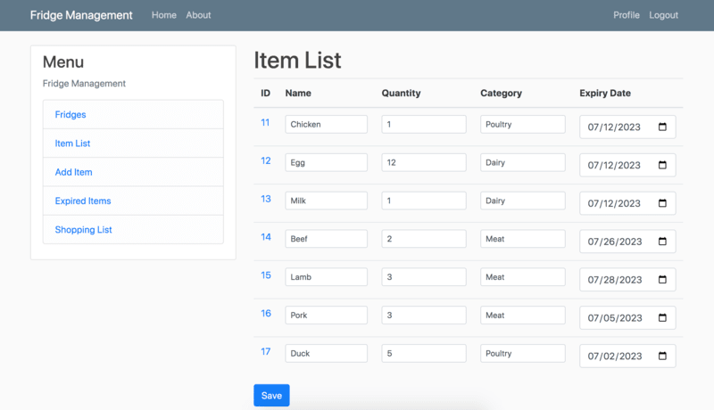
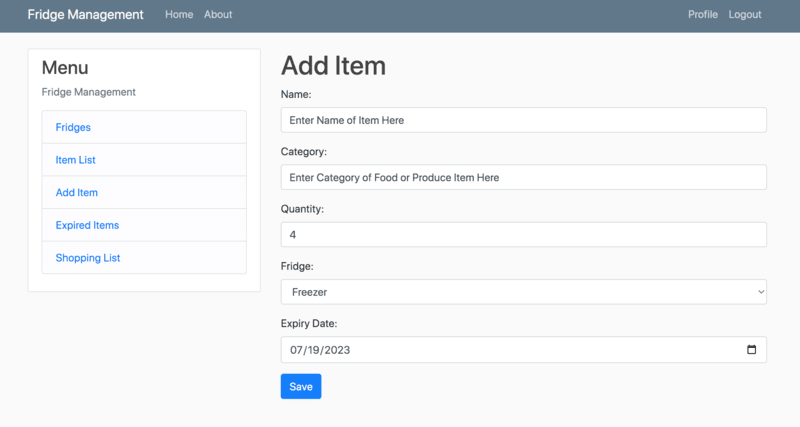
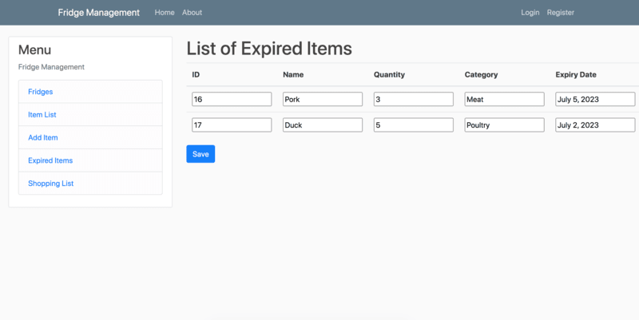
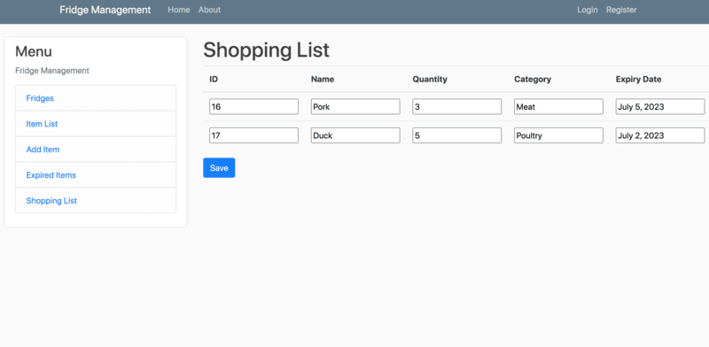
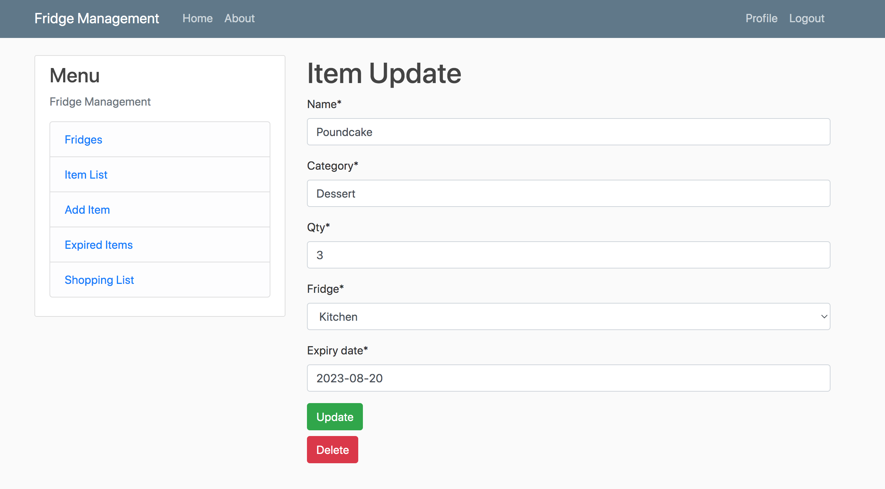

# Fridge Management Web App (Beta)

web app homepage: http://www.fridgemanagement.com/

## System Requirements

-Web Browser only! This is a web application.

## App Features

This application tracks what food and produce items you have in the fridge, and will automatically generate a list of
expired items that need to be replaced for shopping lists.

## App User Guide

On the 'add item' page (click 'add item' in the sidebar menu) add item to fridge database and include name, item
category, quantity, and expiration date.

Display expired items in the fridge

Expired items are automatically added to your shopping list

Remove an item from the fridge or update the number of items for a given item in the fridge 

## Upcoming Features

Individual user accounts with multiple fridges, adding new fridges, and more features are
forthcoming.

## Github URL

https://github.com/adhikarisarthak/fridgemanagement

